# MultiDialect
This mobile application is a final year project that uses gamification, co-operation and simple AR tools to assist users in learning a new language.

## ⚡ Features Available
* Login screen
* Register screen
* Topic screen (for users to choose lesson)
* Learning screen (Includes AR QR-Code Scanning)
* MCQ quiz screen (Single or Multi-Player)

## 🗒 Explanation
This application combines learning language with the ability to challenge other users to participate in quiz together. The MCQ quiz can be done alone for users to practise and it is randomised each time the user attempt the quiz. There are 3 mode level of diffculty, where the question is increased by 5 each time respectively. Multi-Player options would allow users to match up with other users by doing a "search" to ensure that there are users waiting to be match up.

## ⚙️ Tools/How it works
The multi-player options is enable due to firebase realtime database, where it reads changes in realtime. When a user enter their name and click on matching, the database read for changes and store the user in a database table. If there is another user that is available and repeat the above steps, the database would then push this new user to the exisiting user to form a connection, thereby allowing the two users to challenge each other in quiz. Their options are also color-coded to indicte which is player 1 (first join) and which is player 2.

It also uses AR QR-Code where users can scan the QR-Code with their phone camera to display a 3D image of the word that they are trying to learn. Since the QR-Code is on the phone application, it encourages users to learn with a friend whereby they can scan each other phone QR-Code to access the images. Users can also use this to imitate games like "Heads Up!" or "Charades". 

## 💭 Limitations/Improvments
This application has room for improvements since the questions for MCQ are hard-coded and not uploaded to firebase realtime database thus during multi-player mode users would be given 2 different set of questions due to the questions being randomised.

## 👋 Note
The current firebase realtime database url has been disable to prevent data from being written to it hence this application cannot register for new users or multi-player unless the firebase realtime database url is modified and set to your own url when creating a new firebase realtime database

## 👾 Screenshots 
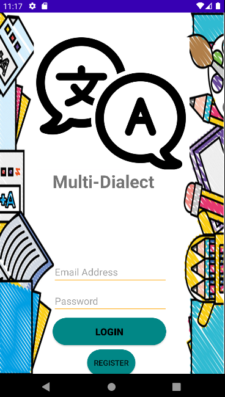 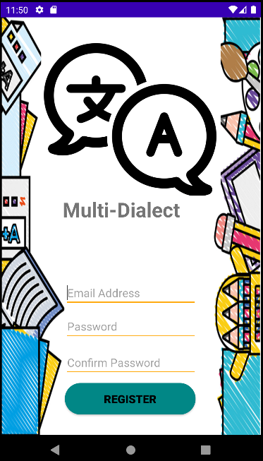
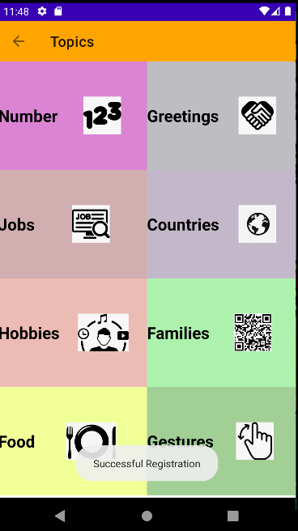 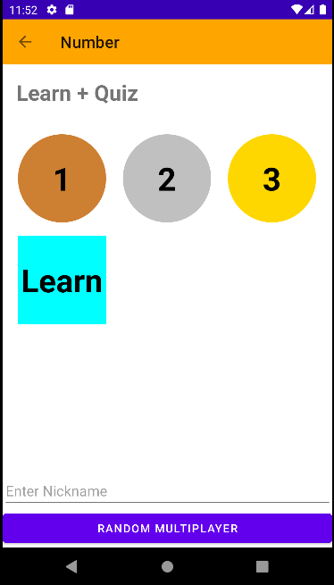
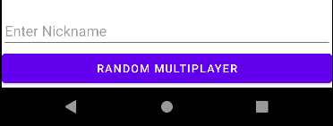 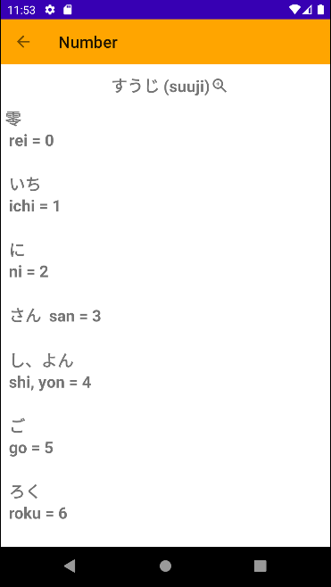
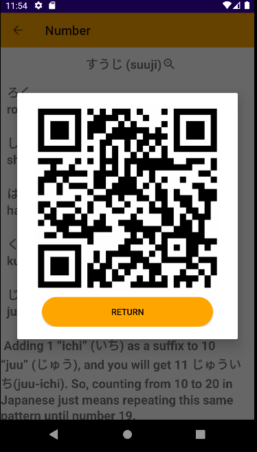 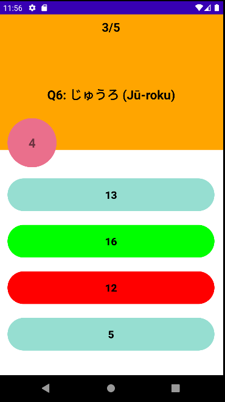
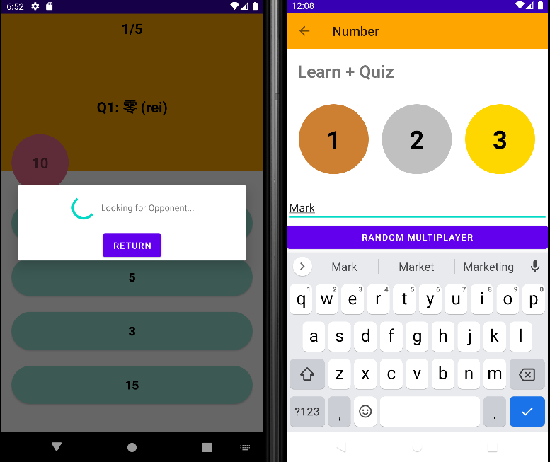 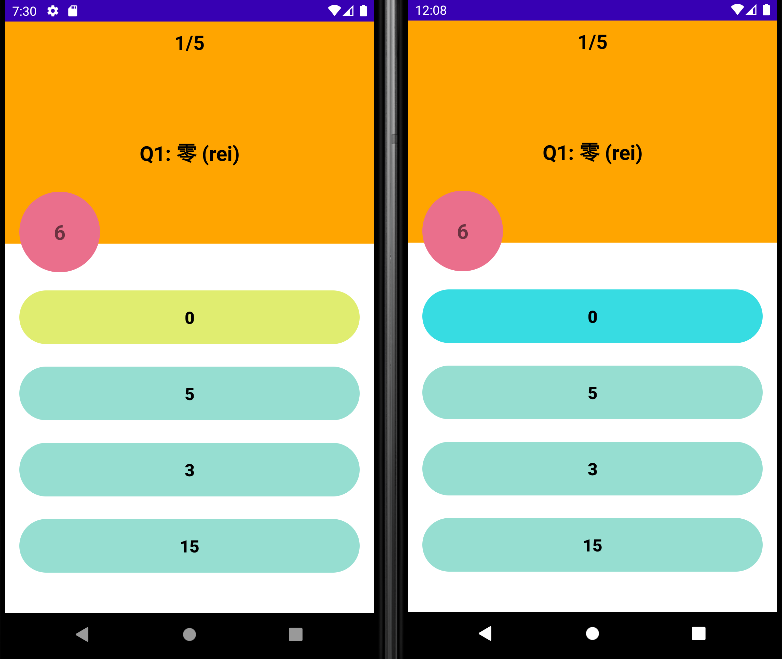
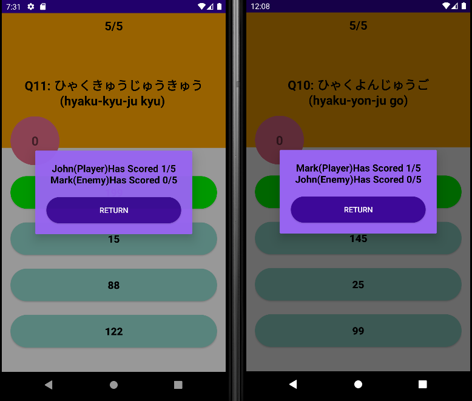
